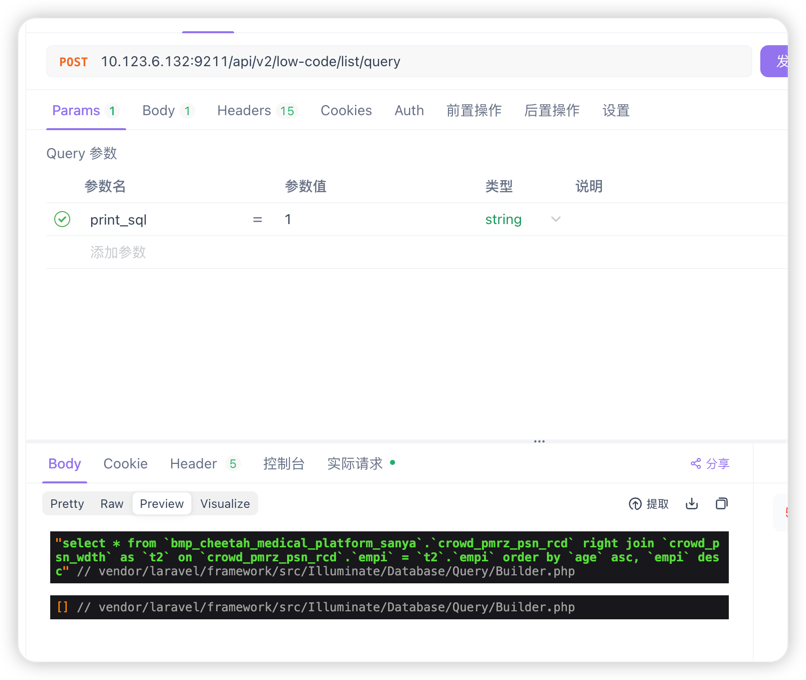

# 低代码包 bmo-low-code
### 安装 Composer 包
-----
```text
composer require bright-liu4917/bmo-low-code
```
-----
### 在 config/app.php配置文件中注册服务提供者：
```text
'providers' => [
    // 其他服务提供者...
    BrightLiu\LowCode\Providers\LowCodeServiceProvider::class,
],
```
-----
### 发布配置文件
```text
php artisan vendor:publish --provider="BrightLiu\LowCode\Providers\LowCodeServiceProvider"
```
-----
### env配置文件
```text
BMO_ORG_ID=用户中心ID 用户中心 org_id 可以不写，预留的
BMP_CHEETAH_MEDICAL_PLATFORM_URI=业务中台接口地址 宝庆老师
BMP_CHEETAH_MEDICAL_CROWD_KIT_URI=人群基线接口地址 童java


基线表 等配置
DB_MEDICAL_PLATFORM_HOST
DB_MEDICAL_PLATFORM_PORT
DB_MEDICAL_PLATFORM_DATABASE
DB_MEDICAL_PLATFORM_USERNAME
DB_MEDICAL_PLATFORM_PASSWORD
DB_MEDICAL_CROWD_PSN_WDTH_TABLE=人员宽表一般是"crowd_psn_wdth"
DB_BUSINESS_CENTER_CROWD_TYPE_TABLE=患者标签关系表一般是 "feature_user_detail"

```
-----
### 执行迁移文件和配置中间件
```text
php artisan migrate

app/Http/Kernel.php.$routeMiddleware 追加如下
 'auth.disease' => DiseaseAuthenticate::class,
 'bmp.disease.auth.inner' => BmpDiseaseAuthenticateInner::class

```
-----

### 内置方法
```text
低代码查询数据
QueryEngineService::instance()
        ->autoClient()//自动获取客户端入参数信息
        
        // 设置查询条件 内置多种查询方法 whereUserId、 whereManageOrgCode、 whereIdCrdNo
        ->whereMixed(
                        [
                            ["ptt_crwd_clsf_cd", "=", "9efe2444eaf14606896bc68290abc5e7"],//模糊查询
                            ["ptt_nm", "like", "朱文奎f"],//模糊查询
                            ["crowd_id", "=", "330121196205038717f"]
                            // ["or", "id_crd_no", "like", "330121196205038717f"],//或查询
                            // ["ptt_nm", "in", ["active", "pending"]],//包含 查询
                            // ["or", "age", "not in", [18, 20]], //不包含
                            // ["slf_tel_no", "between", ["2023-01-01", "2023-12-31"]],//区间查询
                            // ["or", "slf_tel_no", "not between", [60, 80]],//不在区间
                            // ["slf_tel_no", "is", "null"],//是null
                            // ["slf_tel_no", "is not", "null"],//不是null
                            // ["raw", "slf_tel_no = 'active' AND slf_tel_no >= 90"]//原生sql
                        ],
        )
        ->setCache($ttl)//设置缓存时间
        ->orderBy([["id_crd_no", "asc"]])//排序
        ->select(["fields"])//查询字段
        ->getCountResult()//多个查询方法
        

获取患者基础信息
ResidentService::instance()->getBasicInfo($empi)

获取患者完整信息
ResidentService::instance()->getInfo($empi)

更新患者信息
ResidentService::instance()->updateInfo($empi,['age'=>18])

纳管患者 相关参数 manage_org_code,manage_org_name,manage_doctor_code,manage_doctor_name 如不入参 会通过上下文获取
ResidentService::instance()->manageResident($empi,["相关参数"])  

出组患者 相关参数
ResidentService::instance()->removeManageResident($empi,boolean(是否清理纳管信息默认为true))  
```
-----
### 注意事项
```text
1.
⚠️⚠️⚠️ api/v2/low-code/list/query 需要业务自己继承后，重新实现 主要是resource 返回数据结构 ⚠️⚠️⚠️

2.
通知前端必须header入参
X-Gp-Org-Id 机构ID 前端自己申请写死
X-Gp-System-Code 系统编码 研发PM定义 
X-Gp-Disease-Code 疾病编码 后端开发定义 比如 (sanya)
X-Gp-Scene-Code   场景编码 后端开发定义 比如配药（CHRONIC_DISEASE）
```
-----
### 小工具
```text
1 低代码查询方式 入参print_sql=1 打印原生sql 如下图 截图1
```
##### 截图1

-----

### store/templates.json 模板文件以下内容，案例文件在README.md，同级目录下 ⚠️json 内容根据需求自定义
